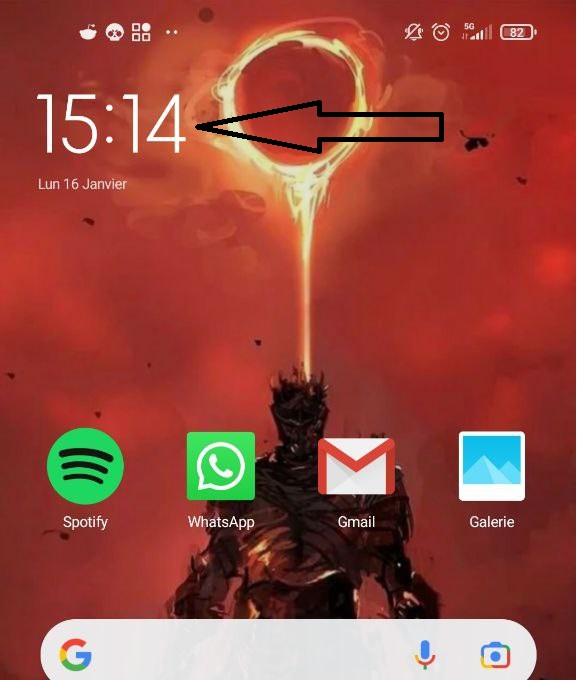
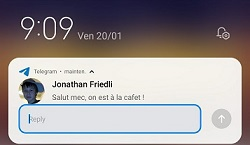

# DAA-AppWidget

## Introduction
Dans le cadre du cours DAA (Développement d'Applications Android) de la HEIG-VD, nous devons explorer et étudier une fonctionnalitée avancée d'Android. Nous avons choisi d'étudier les `AppWidgets`. Ce travail est réalisé en groupe de 3 personnes.

## Auteurs
* Stéphane Marengo
* Géraud Silverstri
* Jonathan Friedli

## Description
Les Widgets sont une sorte de vue d'une application concrète. Ils reprennent souvent la fonctionnalité principale et nous permettent de l'utiliser sans ouvrir l'application. Principalement utilisé dans l'écran d'accueil, ils peuvent être customisé et déplacé. Ils peuvent également être présent sur les écrans vérouillés.

Ils sont également très utile comme publicité pour notre application. En effet, en affichant des informations attirantes, nous allons inciter l'utilisateur à ouvrir notre application.

Il existe plusieurs types de widgets:
* Widgets d'informations
* Widgets de contrôle
* Widgets de collection

### Widgets d'informations
Les widgets d'informations, comme celui de l'horloge, vont afficher des informations en temps réel. 

Exemple:

Ici, nous avons un widget de l'application "horloge" donnant l'heure et la date sur l'écran d'accueil du téléphone. Nous pouvons cliquer dessus afin d'ouvrir ladite application.

D'autres exemple de Widgets d'information sont les widgets de météo, de nouvelles et de résultats sportifs. Ces widgets pourront être mis à jour quand de nouvelles informations sont disponibles.

### Widgets de contrôle
Les widgets de contrôle, comme le widget de spotify, vont permettre de controller et de changer certains états. Dans le cas du widget de musique, nous pouvons changer de musiquer, mettre la musique sur play/pause ou changer le volume sonore.

Exemple:
Widget de l'application Spotify. Ce dernier se trouve sur l'écran vérouillé de notre téléphone. 

Un autre exemple de widget de contrôle est le widget du "curseur de volume" permettant de gérer les différents niveau sonores de notre téléphone (volume des notifications, volumes des médias, etc...).

### Widgets de collection
Les widgets de collection vont afficher une liste d'éléments. Ils permettent, la plupart du temps, de faire un scroll vertical afin de faire défiler la liste. Une autre particularité est nous pouvons souvent cliquer sur un élement de la liste soit pour interagir avec soit pour l'afficher en détails dans l'application.

Par exemple, un widget de todo-list affichant les tâches qu'il nous reste à faire. Dans ce cas, cliquer sur un élement, nous permet de marquer la tâche comme étant faite.

Un autre exemple des wigets de collection serait un widgets affichant les films qu'on a vu récemment.

### Widgets hybrides
Nous venons de voir les 3 principaux types de widgets mais dans la réalité, la plupart des widgets sont des combinaisons de ces 3 types. Notre exemple sur le widget de spotify est en fait un widget hybrid. En effet, bien qu'étant principalement un widget de contrôle, il est également un widget d'information puisqu'il tient à jour l'information de la musique en cours de lecture. 

## Problèmes résolus
L'intéret princpal des widgets est l'accessiblité. En effet, l'accès rapide à une fonctionnalité ou à des informmations importantes est très pratique. Imaginez à quel point ce serait pénible si pour changer de musique, nous devions dévérouiller notre téléphone, ouvrir l'application spotify, chercher la musique que nous voulons écouter, la mettre en lecture, etc. Avec ce widget, nous pouvons changer de musique en 2 secondes.

Un autre avantage est que le widget consomme moins de ressource que l'application. Par conséquent, nous utiliserons moins de batterie et de mémoire vive, si nous pouvons nous passer d'ouvrir l'application.

La personlisation est un autre avantage des widgets. En effet, nous l'utilisateur va pouvoir positionner ses widgets de la manière qui lui plait le mieux.

### Limitations
Un widget a plusieurs limitations.

* Gestes utilisateurs : Les widgets étant sur l'écran d'accueil, ils doivent co-exister avec la navigation existante, ce qui limite les gestes disponibles. Les 2 seuls gestes que peuvent implémenter un widget sont le click et le swipe vertical.

* Fréquence de mise à jour : Un widget ne peut être mis à jour 1 fois par minute au maximum. Ceci les rends peu pratique pour représenter des événements en temps réel.

* Taille : Les widgets ont une taille fixe(ils dépendent de la grille de l'écran), ce qui limite leur utilité et les possibilités de customisation.

### Approches alternatives

#### **Notifications**
Les notifications sont une alternative aux widgets. Elles sont plus flexibles et peuvent être utilisées pour afficher des informations en temps réel. Elles peuvent aussi être modifiées pour intégrer des éléments interactifs. Il y a des nombreuses options en plus pour les notifications tels que les `channels` qui permettent à l'utilisteur de désactiver toutes les notifications d'un certains type ou l'importance des notifications ce qui définit à quel point une notification est visible et audible.

 Les limitations de cette alternative est que le nombre de notifications pouvant être envoyées est limité et dépendant du téléphone de l'utilisateur. De plus, il y a une limite sur le nombre d'update par secondes possible.

 Au niveau de la batterie, plus il y a de notifications, plus la batterie se drainera vite. Cela limite donc le nombre de notifications envoyable à l'utilisateur.

#### **Live wallpapers**
Les `lives wallpapers` sont des fond d'écran animés et interactifs. Il est par exemple possible de mettre une vidéo en fond d'écran et de mettre à disposition des boutons pour avancer/reculer ou baisser le son, etc.

Le seul désavantages des `lives wallpapers` est le fait qu'ils n'ont pas été mis à jour depuis quelques années. Ce qui veut dire qu'ils ne supportent pas les choses tels que les taux de rafraichissement élevés.

Il est important de bien savoir mettre en place un `live wallpaper`, sinon il y a un grand risque que celui-ci consomme beaucoup de RAM et cause du délai sur l'écran d'accueil.

Niveau batterie, la consommation est minime, aucune différence ne sera remarquée lorsque l'on en utilise un.

#### **Raccourcis**
Les raccourcis permettent à l'utilisateur d'ouvrir une application directement sur une fonctionalité de celle-ci. Cela permet de gagner du temps et d'éviter de naviguer dans l'application pour accéder à la fonctionalité désirée. Un exemple commun est un raccourci qui ouvre directement sur la page d'envoi d'un nouveau mail.

Les raccourcis sont très simples à mettre en place et sont très pratiques pour l'utilisateur. Cependant, ils ne permettent pas de faire des interactions complexes. De plus, une écran d'accueil supporte au plus 4 raccourcis.

Etant donné que les raccourcis sont des applications à part entière et qu'ils sont lancés à chaque fois que l'utilisateur clique dessus, ils consomment de la batterie.

### Points importants

## Exemple de code
Dans cet exemple, nous allons réaliser un widget affichant l'heure en temps réel. De plus quand nous cliquons sur ce dernier, nous ouvrons notre application.

### Sources
[Documentation officielle d'Android sur les App Widgets](https://developer.android.com/develop/ui/views/appwidgets/overview)

[Documentation Android du MiT pour les élèves](https://stuff.mit.edu/afs/sipb/project/android/docs/design/patterns/widgets.html)

[Documentation de material design](https://m2.material.io/design/platform-guidance/android-widget.html)

[Articles sur les widgets de electronicshub](https://www.electronicshub.org/what-is-a-widget/)

[Documentation officielle d'Android sur les notifications](https://developer.android.com/develop/ui/views/notifications)

[Documentation sur la consommation des lives wallpapers](https://www.computerworld.com/article/2715685/do-live-wallpapers-cause-noticeable-battery-drain-on-android-.html)

[Documentation officielle d'Android sur les raccourcis d'applications](https://developer.android.com/develop/ui/views/launch/shortcuts)