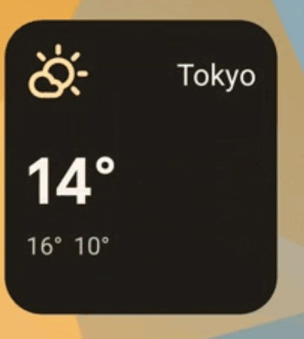
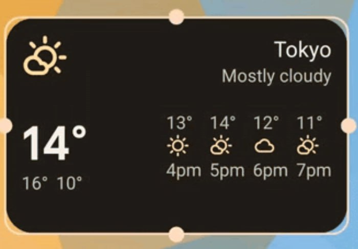
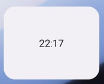
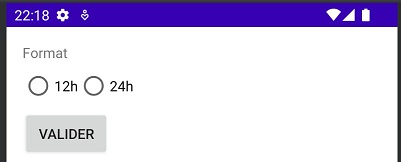
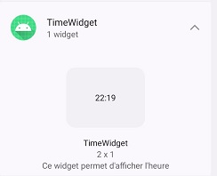
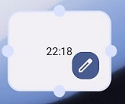

# DAA-AppWidget

## Auteurs
* Stéphane Marengo
* Géraud Silverstri
* Jonathan Friedli

## Description
Les Widgets sont une vue d'une application concrète. Ils reprennent souvent la fonctionnalité principale et nous permettent d'afficher des informations de ladite application. Principalement utilisé dans l'écran d'accueil, ils peuvent être customisé et déplacé. Ils peuvent également être présent sur les écrans de verrouillage.

Ils sont également très utile comme publicité pour notre application. En effet, en affichant des informations attirantes, nous allons inciter l'utilisateur à ouvrir notre application.


Il existe plusieurs types de widgets:
* Widgets d'informations
* Widgets de contrôle
* Widgets de collection


### Widgets d'informations


Ici, nous avons un widget de l'application "horloge" donnant l'heure et la date sur l'écran d'accueil du téléphone. Nous pouvons cliquer dessus afin d'ouvrir ladite application.

D'autres exemple de Widgets d'information sont les widgets de météo, de nouvelles et de résultats sportifs.

### Widgets de contrôle
Les widgets de contrôle, comme le widget de spotify, vont permettre de controller et de changer certains états. Dans le cas du widget de musique, nous pouvons changer de musiquer, mettre la musique sur play/pause ou changer le volume sonore.

La gestion des cliques n'est pas directe et doit passer par des `intents` qui doivent donc être gérés par une autre partie de l'application (comme par exemple, une activité ou un service).

Exemple:
Widget de l'application Spotify. Ce dernier se trouve sur l'écran de verrouillage de notre téléphone. 


### Widgets de collection
Les widgets de collection vont afficher une liste d'éléments. Ils permettent, la plupart du temps, de faire un scroll vertical afin de faire défiler la liste. Une autre particularité est nous pouvons souvent cliquer sur un élement de la liste, soit pour interagir avec soit, pour l'afficher en détails dans l'application.

Par exemple, un widget de todo-list affichant les tâches qu'il nous reste à faire. Dans ce cas, cliquer sur un élement, nous permet de marquer la tâche comme étant faite.

### Widgets hybrides
Nous venons de voir les 3 principaux types de widgets mais dans la réalité, la plupart des widgets sont des combinaisons de ces 3 types. Notre exemple sur le widget de spotify est en fait un widget hybrid. En effet, bien qu'étant principalement un widget de contrôle, il est également un widget d'information puisqu'il tient à jour l'information de la musique en cours de lecture. 

## Problèmes résolus
L'intéret princpal des widgets est l'accessiblité. En effet, l'accès rapide à une fonctionnalité ou à des informmations importantes est très pratique. Imaginez à quel point ce serait pénible si pour changer de musique, nous devions déverrouiller notre téléphone, ouvrir l'application spotify, chercher la musique que nous voulons écouter, la mettre en lecture, etc. Avec ce widget, nous pouvons changer de musique en 2 secondes.

Un autre avantage est que le widget consomme moins de ressource que l'application. Par conséquent, nous utiliserons moins de batterie et de mémoire vive, si nous pouvons nous passer d'ouvrir l'application.

La personalisation est un autre avantage des widgets. En effet, l'utilisateur va pouvoir positionner ses widgets de la manière qui lui plait le mieux.

## Limitations
Un widget a plusieurs limitations.

### Gestes utilisateurs
Les widgets étant sur l'écran d'accueil, ils doivent co-exister avec la navigation existante, ce qui limite les gestes disponibles. Les 2 seuls gestes que peuvent implémenter un widget sont le click et le swipe vertical.

### Fréquence de mise à jour
Un widget ne peut être mis à jour 1 fois toutes les 30 minutes pour une durée maximale de 10 secondes. Si le temps d'update est suppérieur à 10 secones, cette dernière est considérée comme "not responding". Il est également possible d'utiliser une méthode `goAsync`, cela permet d'obtenir 30 secondes pour la mise à jour mais elle possède ses propres limitations. 
A cause de cela, il est souvent nécessaire de combiner les widgets avec d'autres méchanismes pour avoir des informations à jour (exemple: workmanager).

### Taille
Les widgets ont une taille fixe (ils dépendent de la grille de l'écran), ce qui limite leur utilité et les possibilités de customisation. Il est cependant possible de créer des layouts de widgets différent en fonction de la taille. Exemple:




Chaque constructeur propose des grilles différentes ce qui rend compliqué la création de widgets universels et reponsives. Cependant depuis Android 12, il y a des options `targetCellWidth` et `targetCellHeight` qui permettent de définir la taille minimale du widget. Avant cette version, il était nécessaire d'utiliser `minWidth` et `minHeight` pour définir la taille en pixels.
 
### Approches alternatives

#### **Notifications**
Les notifications sont une alternative aux widgets. Elles sont plus flexibles et peuvent être utilisées pour afficher des informations en temps réel. Elles peuvent aussi être modifiées pour intégrer des éléments interactifs. Il y a des nombreuses options en plus pour les notifications tels que les `channels` qui permettent à l'utilisteur de désactiver toutes les notifications d'un certains type ou l'importance des notifications ce qui définit à quel point une notification est visible et audible.

 Les limitations de cette alternative est que le nombre de notifications pouvant être envoyées est limité et dépendant du téléphone de l'utilisateur. De plus, il y a une limite sur le nombre d'update par secondes possible.

 Au niveau de la batterie, plus il y a de notifications, plus la batterie se drainera vite. Cela limite donc le nombre de notifications envoyable à l'utilisateur.

 Exemple de notification:


#### **Live wallpapers**
Les `lives wallpapers` sont des fond d'écran animés et interactifs. Il est par exemple possible de mettre une vidéo en fond d'écran et de mettre à disposition des boutons pour avancer/reculer ou baisser le son, etc.

Le seul désavantages des `lives wallpapers` est le fait qu'ils n'ont pas été mis à jour depuis quelques années. Ce qui veut dire qu'ils ne supportent pas les choses tels que les taux de rafraichissement élevés.

Il est important de bien savoir mettre en place un `live wallpaper`, sinon il y a un grand risque que celui-ci consomme beaucoup de RAM et cause du délai sur l'écran d'accueil.

Niveau batterie, la consommation est minime, aucune différence ne sera remarquée lorsque l'on en utilise un.

#### **Raccourcis**
Les raccourcis permettent à l'utilisateur d'ouvrir une application directement sur une activité spécifique de celle-ci. Cela permet de gagner du temps et d'éviter de naviguer dans l'application pour accéder à la fonctionalité désirée. Un exemple commun est un raccourci qui ouvre directement sur la page d'envoi d'un nouveau mail.

Les raccourcis sont très simples à mettre en place et sont très pratiques pour l'utilisateur. Cependant, ils ne permettent pas de faire des interactions complexes.

Etant donné que les raccourcis sont des applications à part entière et qu'ils sont lancés à chaque fois que l'utilisateur clique dessus, ils consomment de la batterie.

## WidgetHost
Il est possible de créer des `WidgetHost` permettant de créer. notamment, des écrans d'accueil personnalisé. Cette partie n'est pas abordée car elle est très complexe et dépend énormément de la version d'Android et des constructeurs.

## Points à retenir

* Les widgets possèdent une certaine limitation fonctionnelle.
* Il y a eu énormément de changements concernant les widgets entre les différentes versions d'Android.
* Il est possible de créer des widgets sans avoir à créer une application complète.
* Les widgets se trouvent dans des `RemoteView`, ce qui limite très fortement les contrôles qui peuvent s'y trouver.
* Il est possible de fournir une activité permettant de configurer ou de reconfigurer le widget. Les valeurs configurées sont généralement stockées dans un fichier de préférences.
* Les AppWidgets sont un sujet très vaste et n'ont été abordé qu'en surface dans ce document. C'est d'ailleurs pour ça que les widgets ne sont pas très commun.

## Marche à suivre pour créer un widget
### 1. Création du AppWidgetProvider
```kt
class TimeWidget : AppWidgetProvider() {
    override fun onUpdate(context: Context,appWidgetManager: AppWidgetManager,
        appWidgetIds: IntArray) {
        for (appWidgetId in appWidgetIds) {
            updateAppWidget(context, appWidgetManager, appWidgetId)
        }
    }

    override fun onDeleted(context: Context, appWidgetIds: IntArray) {
        for (appWidgetId in appWidgetIds) {
            TimeWidgetConfigureActivity.deleteOption(context, appWidgetId)
        }
    }
    // ...
}
```
La classe ci-dessus est responsable de la gestion du cycle de vie du widget. La méthode `onUpdate` est appelée à la fréquence définie dans le fichier de configuration de l'étape 2.


### 2. Création du fichier de metadonnées
```xml
<?xml version="1.0" encoding="utf-8"?>
<appwidget-provider xmlns:android="http://schemas.android.com/apk/res/android"
    android:configure="ch.heigvd.daa_group4.TimeWidgetConfigureActivity"
    android:description="@string/app_widget_description"
    android:initialKeyguardLayout="@layout/time_widget"
    android:initialLayout="@layout/time_widget"
    android:minWidth="130dp"
    android:minHeight="10dp"
    android:previewLayout="@layout/time_widget"
    android:resizeMode="horizontal|vertical"
    android:targetCellWidth="2"
    android:targetCellHeight="1"
    android:updatePeriodMillis="0"
    android:widgetCategory="home_screen|keyguard"
    android:widgetFeatures="reconfigurable|configuration_optional" />
```
La valeur de `updatePeriodMillis` ne peut pas être plus petite que 30min. Si nous avons besoin de mettre à jour, nous devons utiliser un autre système (par exemple, WorkManager pour les update toutes les 15 minutes). Dans notre cas, nous désactivons les update automatiques.

### 3. Ajout dans le manifest
```xml
<receiver
    android:name=".TimeWidget"
    android:exported="false">
    <intent-filter>
        <action android:name="android.appwidget.action.APPWIDGET_UPDATE" />
    </intent-filter>

    <meta-data
    android:name="android.appwidget.provider"
    android:resource="@xml/time_widget_info" />
</receiver> 

<activity
    android:name=".TimeWidgetConfigureActivity"
    android:exported="false">
    <intent-filter>
        <action android:name="android.appwidget.action.APPWIDGET_CONFIGURE" />
    </intent-filter>
</activity>
```

### 4. Création de l'activité de configuration (optionnel)


### 5. 

Voici à quoi ressemble notre widget:



Et voici l'application:



Ajout du widget sur l'écran d'accueil:





```kt
internal fun updateAppWidget(
    context: Context,
    appWidgetManager: AppWidgetManager,
    appWidgetId: Int
) {
    val is24 = TimeWidgetConfigureActivity.loadOption(context, appWidgetId)
    // Construct the RemoteViews object
    val views = RemoteViews(context.packageName, R.layout.time_widget)

    val format = if (is24) "HH:mm" else "hh:mm a"

    views.setCharSequence(R.id.appwidget_clock, "setFormat12Hour", format)
    views.setCharSequence(R.id.appwidget_clock, "setFormat24Hour", format)

    // Instruct the widget manager to update the widget
    appWidgetManager.updateAppWidget(appWidgetId, views)
}
```

Fichier xml du widget:


```kt
class TimeWidgetConfigureActivity : Activity() {
    companion object {
        private const val PREFS_NAME = "ch.heigvd.daa_group4.TimeWidget"
        private const val PREF_PREFIX_KEY = "appwidget_"

        internal fun saveOption(context: Context, appWidgetId: Int, is24: Boolean) {
            context.getSharedPreferences(PREFS_NAME, Context.MODE_PRIVATE).edit {
                putBoolean(PREF_PREFIX_KEY + appWidgetId, is24)
            }
        }

        internal fun hasOption(context: Context, appWidgetId: Int): Boolean {
            val prefs = context.getSharedPreferences(PREFS_NAME, Context.MODE_PRIVATE)
            return prefs.contains(PREF_PREFIX_KEY + appWidgetId)
        }

        internal fun loadOption(context: Context, appWidgetId: Int): Boolean {
            val prefs = context.getSharedPreferences(PREFS_NAME, Context.MODE_PRIVATE)
            return prefs.getBoolean(PREF_PREFIX_KEY + appWidgetId, true)
        }

        internal fun deleteOption(context: Context, appWidgetId: Int) {
            context.getSharedPreferences(PREFS_NAME, Context.MODE_PRIVATE).edit {
                remove(PREF_PREFIX_KEY + appWidgetId)
            }
        }
    }

    private var appWidgetId = AppWidgetManager.INVALID_APPWIDGET_ID
    private var selectedRadio: RadioButton? = null

    private lateinit var binding: TimeWidgetConfigureBinding

    public override fun onCreate(icicle: Bundle?) {
        super.onCreate(icicle)

        // Set the result to CANCELED.  This will cause the widget host to cancel
        // out of the widget placement if the user presses the back button.
        setResult(RESULT_CANCELED)

        binding = TimeWidgetConfigureBinding.inflate(layoutInflater)
        setContentView(binding.root)

        binding.radioGroup.setOnCheckedChangeListener { _, checkedId ->
            selectedRadio = when (checkedId) {
                R.id.radio_12 -> binding.radio12
                R.id.radio_24 -> binding.radio24
                else -> null
            }
        }

        binding.addButton.setOnClickListener {
            val context = this@TimeWidgetConfigureActivity

            if (selectedRadio == null) {
                Toast.makeText(context, getString(R.string.no_radio_selected), Toast.LENGTH_SHORT)
                    .show()
                return@setOnClickListener
            }

            // When the button is clicked, store the radio locally
            saveOption(context, appWidgetId, selectedRadio?.id == R.id.radio_24)

            // It is the responsibility of the configuration activity to update the app widget
            val appWidgetManager = AppWidgetManager.getInstance(context)
            updateAppWidget(context, appWidgetManager, appWidgetId)

            // Make sure we pass back the original appWidgetId
            val resultValue = Intent()
            resultValue.putExtra(AppWidgetManager.EXTRA_APPWIDGET_ID, appWidgetId)
            setResult(RESULT_OK, resultValue)
            finish()
        }

        // Find the widget id from the intent.
        val intent = intent
        val extras = intent.extras
        if (extras != null) {
            appWidgetId = extras.getInt(
                AppWidgetManager.EXTRA_APPWIDGET_ID, AppWidgetManager.INVALID_APPWIDGET_ID
            )
        }

        // If this activity was started with an intent without an app widget ID, finish with an error.
        if (appWidgetId == AppWidgetManager.INVALID_APPWIDGET_ID) {
            finish()
            return
        }

        if (hasOption(this, appWidgetId)) {
            val is24 = loadOption(this, appWidgetId)
            selectedRadio = if (is24) binding.radio24 else binding.radio12
            selectedRadio?.isChecked = true
        }
    }
}
```


### Sources
[Documentation officielle d'Android sur les App Widgets](https://developer.android.com/develop/ui/views/appwidgets/overview)

[Documentation Android du MiT pour les élèves](https://stuff.mit.edu/afs/sipb/project/android/docs/design/patterns/widgets.html)

[Documentation de material design](https://m2.material.io/design/platform-guidance/android-widget.html)

[Articles sur les widgets de electronicshub](https://www.electronicshub.org/what-is-a-widget/)

[Documentation officielle d'Android sur les notifications](https://developer.android.com/develop/ui/views/notifications)

[Documentation sur la consommation des lives wallpapers](https://www.computerworld.com/article/2715685/do-live-wallpapers-cause-noticeable-battery-drain-on-android-.html)

[Documentation officielle d'Android sur les raccourcis d'applications](https://developer.android.com/develop/ui/views/launch/shortcuts)