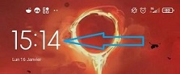
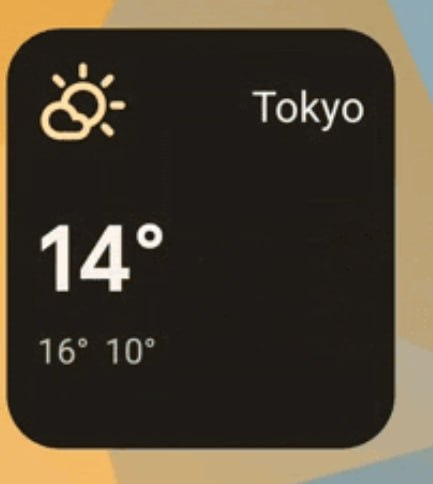
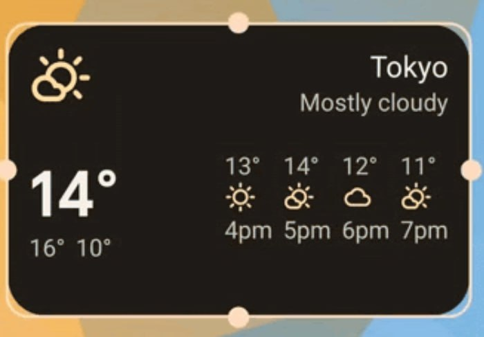
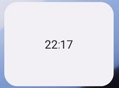
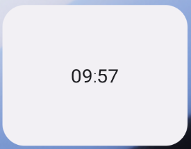
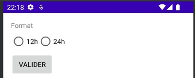
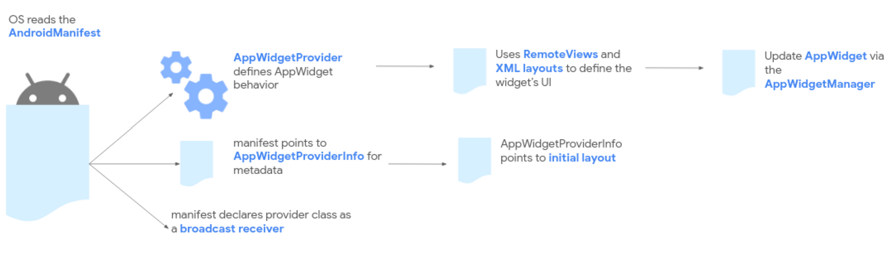
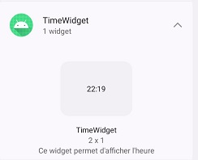
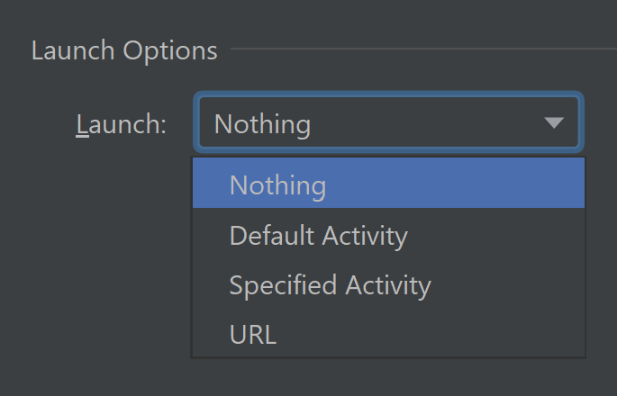
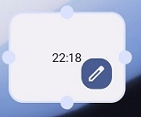

## Description
Les widgets sont une vue simplifiée d'une application, ne possédant pas d'activitié propre. Utilisés sur l'écran d'accueil ou de verouillage, ils peuvent être customisé et déplacé. Les différents types sont décrits ci-dessous.


### Widgets d'informations


Ici, nous avons un widget de l'application "horloge" donnant l'heure et la date sur l'écran d'accueil du téléphone. Nous pouvons cliquer dessus afin d'ouvrir l'application.


### Widgets de contrôle
Les widgets de contrôle, comme le widget de Spotify, vont permettre de contrôler et de changer certains états. Dans le cas de Spotify, nous pouvons changer de musiquer ou la mettre en pause/play. Les widgets étant stateless, ces états doivent être gérés par une autre partie de l'application.

La gestion des cliques n'est pas directe et doit passer par des **intents** qui doivent être gérés par une autre partie de l'application (comme par exemple, une activité ou un service).

{height=100}

\newpage

### Widgets de collection
Les widgets de collection vont afficher une liste d'éléments. Ils permettent, la plupart du temps, de faire un scroll vertical afin de faire défiler la liste. Généralement, un clic sur un élément produira une action ou l'ouverture d'une activité en y passant des informations liés à l'élément cliqué.

Par exemple, un widget de todo-list permet de cliquer un élément pour le marquer comme **done**.

### Widgets hybrides
Nous venons de voir les 3 principaux types de widgets, mais dans la réalité, la plupart des widgets sont des combinaisons de ces 3 types. Notre exemple sur le widget de Spotify est en fait un widget hybride. En effet, bien qu'étant principalement un widget de contrôle, il fait également office de widget d'information puisqu'il tient à jour l'information de la musique en cours de lecture.

## Problèmes résolus
L'intérêt principal des widgets est l'accessibilité. En effet, l'accès rapide à une fonctionnalité ou à des informations importantes est très pratique pour l'utilisateur. Imaginez à quel point cela serait pénible si pour changer de musique, nous devions déverrouiller notre téléphone, ouvrir l'application Spotify (et donc lancer une activité complète) puis cliquer sur le bouton suivant. Avec ce widget, nous pouvons changer de musique sans lancer d'activité (plus agréable pour l'utilisateur) et cela permet d'économiser des ressources (batterie, mémoire, etc.).

La personnalisation est un autre avantage des widgets. L'utilisateur va pouvoir positionner ses widgets de la manière qui lui plaît le mieux. De plus, il est possible de créer une activité de configuration pour nos widgets permettant de mettre à disposition des options à l'utilisateur.

## Limitations
### Gestes utilisateurs
Les widgets étant sur l'écran d'accueil, ils doivent co-exister avec la navigation existante, ce qui limite les gestes disponibles. Les 2 seuls gestes que peuvent implémenter un widget sont le clic et le scroll vertical.

### Fréquence de mise à jour
Un widget ne peut être mis à jour via le système qu'une fois toutes les 30 minutes pour une durée maximale de 10 secondes. Si le temps de mise à jour est supérieur, le widget peut être considéré comme bloqué et le système peut envoyer une erreur **Application not responding**. Il est également possible d'utiliser une méthode **goAsync** permettant d'étendre cette durée de 10 secondes à 30 secondes, mais possède d'autres limitations non abordées ici.

Il est recommandé de ne pas abuser de ce mécanisme pour la mise à jour son widget pour éviter de drainer la batterie de l'utilisateur.

À cause de cela, il est souvent nécessaire de combiner les widgets avec d'autres mécanismes tels que **WorkManager** ou **JobScheduler**.

### Taille
Les widgets ont une taille fixe (ils dépendent de la grille de l'écran), ce qui limite leur utilité et les possibilités de customisation. Il est cependant possible de créer des layouts différent en fonction de la taille.

{width=40%, height=150}
{width=60%, height=150}
\begin{figure}[!h]
\caption{Layout adaptatif}
\end{figure}

Chaque constructeur de téléphone propose des grilles différentes ce qui rend compliquée la création de widgets universels et reponsives. Cependant depuis Android 12, des options **targetCellWidth** et **targetCellHeight** permettant de définir la taille par défaut du widget sur la grille sont disponibles. Pour les versions antérieurs, il est nécessaire d'utiliser **minWidth** et **minHeight** pour définir cette taille en pixels.

## Approches alternatives
### Notifications
Les notifications sont une alternative aux widgets. Elles sont plus flexibles et peuvent être utilisées pour afficher des informations en temps réel. Elles peuvent aussi être modifiées pour intégrer des éléments interactifs. Il y a des nombreuses options en plus pour les notifications tels que les **channels** qui permettent à l'utilisateur de désactiver toutes les notifications d'un certain type ou l'importance des notifications ce qui définit à quel point une notification est visible et audible.

### Live wallpapers
Les **live wallpapers** sont des fonds d'écran animés et interactifs. Il est par exemple possible de mettre une vidéo en fond d'écran et de mettre à disposition des boutons pour avancer/reculer. Leur utilisation nécessite une bonne connaissance de l'API pour éviter les problèmes de performance et de consommation de ressources.

### Raccourcis
Les raccourcis permettent à l'utilisateur d'ouvrir une application directement sur une activité spécifique. Cela permet de gagner du temps et d'éviter de naviguer dans l'application pour accéder à la fonctionnalité désirée. Un exemple commun est un raccourci qui ouvre directement sur la page d'envoi d'un nouveau mail.

## WidgetHost
Il est possible de créer des **WidgetHost** permettant de créer, notamment, des écrans d'accueil personnalisé pouvant accueilir des widgets. Cette partie n'est pas abordée ici.

## Points essentiels à retenir
* Seul le clic et le scroll peuvent être gérés sur les widgets. Lors d'un clic, il est possible de créer une **PendingIntent** pour lancer une activité spécifique (avec d'éventuels paramètres).
* Les widgets en tant que tels sont limités fonctionnellement et nécessitent généralement une combinaison avec d'autres mécanismes pour être utilisés efficacement (**WorkManager**, **JobScheduler**, etc.).
* Il est possible de créer des widgets sans avoir d'activité principale.
* Les widgets utilisent exclusivement des **RemoteView**, ce qui limite très fortement les contrôles et les layouts pouvant être utilisés (voir la [documentation](https://developer.android.com/reference/android/widget/RemoteViews)). Depuis l'API 31, il est possible d'utiliser des **CheckBox**, **RadioButton**, **RadioGroup** et **Switch**, mais pas d'éventuelle sous-classe de ces contrôles.
* Il est possible de définir une activité permettant de configurer ou de reconfigurer un widget. Le stockage de la configuration est généralement géré avec les **SharedPreference**.
* [Jetpack Glance](https://developer.android.com/jetpack/androidx/releases/glance) (en alpha depuis peu) permet de créer des widgets à l'aide de **Compose**.
* Il y a eu énormément de changements concernant les widgets entre les différentes versions d'Android. Il est donc important de consulter la documentation.
* La création de widgets est un domaine compliqué. La documentation officielle est un très bon point de départ car elle est complète et couvre de nombreux aspects avec des exemples.
* Les App Widgets sont un sujet très vaste et n'ont été abordé qu'en surface dans ce document.

\newpage

## Mise en œuvre
Nous allons proposer un exemple simple permettant de créer un widget affichant l'heure. Il sera possible de le configurer pour afficher l'heure au format 12 h ou 24 h. Nous n'allons pas créer d'activité principale, de ce fait, rien ne se passera lorsque du clic sur ce dernier.

{width=20%}
{width=20%}
{width=60%}
\begin{figure}[!h]
\caption{Résultat final}
\end{figure}

Voici un schéma tiré de la documentation officielle décrivant le flow d'exécution d'un widget.



### 1. Création du AppWidgetProvider
```kotlin
class TimeWidget : AppWidgetProvider() {
    override fun onUpdate(context: Context,appWidgetManager: AppWidgetManager,
        appWidgetIds: IntArray) {
        for (appWidgetId in appWidgetIds) {
            updateAppWidget(context, appWidgetManager, appWidgetId)
        }
    }

    override fun onDeleted(context: Context, appWidgetIds: IntArray) {
        for (appWidgetId in appWidgetIds) {
            TimeWidgetConfigureActivity.deleteOption(context, appWidgetId)
        }
    }
    // d'autres événements peuvent être gérés ici
}

internal fun updateAppWidget(context: Context, appWidgetManager: AppWidgetManager,
 appWidgetId: Int) {
    val views = RemoteViews(context.packageName, R.layout.time_widget)

    val is24 = TimeWidgetConfigureActivity.loadOption(context, appWidgetId)
    val format = if (is24) "HH:mm" else "hh:mm a"

    // Impossible d'accéder directement aux vues de notre layout
    views.setCharSequence(R.id.appwidget_clock, "setFormat12Hour", format)
    views.setCharSequence(R.id.appwidget_clock, "setFormat24Hour", format)

    // On affecte la nouvelle vue mise à jour au widget
    appWidgetManager.updateAppWidget(appWidgetId, views)
}
```

La classe ci-dessus est responsable de la gestion du comportement pour un type de widget. Elle sera utilisée par tous les widgets de ce type.

La méthode **onUpdate** est appelée selon la fréquence définie dans le fichier de configuration de l'étape 2. Dans notre cas, nous désactiverons ce comportement. C'est dans cette méthode que nous pourrions définir des actions en cas d'interaction avec le widget (comme par exemple un clic sur un bouton). La gestion de ces événements s'effectue au moyen d'**Intent**. Lors d'un clic, il est possible de créer une **PendingIntent** pour lancer une activité spécifique (avec d'éventuels paramètres).

**updateAppWidget** est une fonction interne permettant de mettre à jour la vue du widget et qui sera utilisée après modification de la configuration du widget. Comme nous devons utiliser des **RemoteView**, nous ne pouvons pas accéder directement aux vues de notre layout. Nous devons donc utiliser les méthodes fournies telles que **setCharSequence** pour modifier les propriétés de nos vues, ce qui n'est pas très intuitif et peut être source d'erreur si le nom de la méthode à appeler n'est pas correct. Ces méthodes utilisant de la réflexion, l'IDE n'est pas en mesure de nous fournir d'intellisense, rendant la tâche encore plus prône à l'erreur.

Une autre méthode qu'il pourrait être intéressant de surcharger est **onAppWidgetOptionsChanged**. Elle est appelée lorsque le widget est placé pour la première et à chaque fois que sa taille change. Ceci permet donc de mettre en place un layout différent en fonction de la taille actuelle du widget.

\newpage

### 2. Création du fichier de metadonnées
```xml
<?xml version="1.0" encoding="utf-8"?>
<appwidget-provider xmlns:android="http://schemas.android.com/apk/res/android"
    android:configure="ch.heigvd.daa_group4.TimeWidgetConfigureActivity"
    android:description="@string/app_widget_description"
    android:initialKeyguardLayout="@layout/time_widget"
    android:initialLayout="@layout/time_widget"
    android:minWidth="130dp"
    android:minHeight="10dp"
    android:previewLayout="@layout/time_widget"
    android:resizeMode="horizontal|vertical"
    android:targetCellWidth="2"
    android:targetCellHeight="1"
    android:updatePeriodMillis="0"
    android:widgetCategory="home_screen|keyguard"
    android:widgetFeatures="reconfigurable|configuration_optional" />
```

L'attribut **configure** permet de définir l'activité qui devra être ouverte lorsque l'utilisateur souhaite configurer le widget.

La valeur de **updatePeriodMillis** ne peut pas être plus petite que 30 minutes. Une valeur de 0 permet de désactiver ces mises à jour périodiques.

**previewLayout** (Android 12) correspond au layout qui sera utilisé dans la liste affichant les widgets disponibles. Pour les versions antérieures, il faut utiliser l'attribut **previewImage**. Le contenu de ce layout doit être statique. Dans le cas où le contenu du widget est dynamique (par exemple une liste), il sera nécessaire de créer un layout statique par élément devant être affiché. Cette partie est détaillée dans la documentation officielle.

{width=200px}

**reconfigurable|configuration_optional** permet d'indiquer que notre widget possède une activité de configuration et qu'elle est optionnelle (elle ne s'ouvrira pas automatiquement lors de l'ajout du widget).

\newpage

### 3. Création de l'activité de configuration
```kotlin
class TimeWidgetConfigureActivity : Activity() {
    companion object {
        private const val PREFS_NAME = "ch.heigvd.daa_group4.TimeWidget"
        private const val PREF_PREFIX_KEY = "appwidget_"

        internal fun saveOption(context: Context, appWidgetId: Int, is24: Boolean) 
        {
            // Sauvegarde dans les préfs avec clé = PREF_PREFIX_KEY + appWidgetId
        }

        // fonctions hasOption, loadOption et deleteOption omises.
    }

    private var appWidgetId = AppWidgetManager.INVALID_APPWIDGET_ID
    private var selectedRadio: RadioButton? = null
    private lateinit var binding: TimeWidgetConfigureBinding

    public override fun onCreate(icicle: Bundle?) {
        super.onCreate(icicle)

        // CANCELED pour pouvoir annuler le placement 
        // du widget si l'utilisateur quitte l'activité (bouton retour)
        setResult(RESULT_CANCELED)

        binding = TimeWidgetConfigureBinding.inflate(layoutInflater)
        setContentView(binding.root)

        binding.radioGroup.setOnCheckedChangeListener { _, checkedId ->
            // Gestion du bouton radio sélectionné
        }

        binding.addButton.setOnClickListener {
            val context = this@TimeWidgetConfigureActivity

            if (selectedRadio == null) {
                Toast.makeText(context, getString(R.string.no_radio_selected), 
                    Toast.LENGTH_SHORT)
                    .show()
                return@setOnClickListener
            }

            // Sauvegarde des préférences
            saveOption(context, appWidgetId, selectedRadio?.id == R.id.radio_24)

            // Le widget doit être explicitement mis à jour par l'activité 
            // de configuration (onUpdate pas appelé automatiquement)
            val appWidgetManager = AppWidgetManager.getInstance(context)
            updateAppWidget(context, appWidgetManager, appWidgetId)

            val resultValue = Intent()
            resultValue.putExtra(AppWidgetManager.EXTRA_APPWIDGET_ID, appWidgetId)
            setResult(RESULT_OK, resultValue)
            finish()
        }

        // Récupération de l'id du widget
        val extras = intent.extras
        if (extras != null) {
            appWidgetId = extras.getInt(
                AppWidgetManager.EXTRA_APPWIDGET_ID, 
                AppWidgetManager.INVALID_APPWIDGET_ID
            )
        }

        // L'activité n'a pas été lancée par un widget
        if (appWidgetId == AppWidgetManager.INVALID_APPWIDGET_ID) {
            finish()
            return
        }

        // Chargement des préférences si elles existent
        if (hasOption(this, appWidgetId)) {
            val is24 = loadOption(this, appWidgetId)
            selectedRadio = if (is24) binding.radio24 else binding.radio12
            selectedRadio?.isChecked = true
        }
    }
}
```

Cette activité sera créée à chaque fois que l'utilisateur souhaite configurer le widget. Dans notre exemple, elle effectue simplement la gestion du bouton radio permettant de choisir le format d'affichage de l'heure.

\newpage

### 4. Ajout dans le manifest
```xml
<receiver
    android:name=".TimeWidget" android:exported="false">
    <intent-filter>
        <action android:name="android.appwidget.action.APPWIDGET_UPDATE" />
    </intent-filter>

    <meta-data android:name="android.appwidget.provider"
    android:resource="@xml/time_widget_info" />
</receiver> 

<activity android:name=".TimeWidgetConfigureActivity"
    android:exported="false">
    <intent-filter>
        <action android:name="android.appwidget.action.APPWIDGET_CONFIGURE" />
    </intent-filter>
</activity>
```

Le **receiver** correspond à notre widget et **activity** nous permet de définir l'activité utilisée pour la configuration.

### 5. Layouts
Le widget utilise le fichier **time_widget.xml** contenant uniquement une **TextClock** dans un **RelativeLayout**.

L'activité de configuration, quant à elle, utilise le fichier **time_widget_configure.xml** définissant l'interface présentée plus haut comportant les boutons radio.

### 6. Lancement via Android Studio
Étant donné que nous n'avons pas spécifié d'activité par défaut (**intent MAIN**) dans le manifeste, il faut modifier la configuration de lancement d'Android Studio pour ne pas tenter de la lancer.

{ height=150px }

Si nous avions une activité par défaut, cette dernière serait lancée lors du clic sur le widget (comportement par défaut qui peut être changé).

### 7. Résultat
Désormais, le widget peut être ajouté. Après son ajout, il est possible de cliquer sur l'icône **crayon** pour accéder à l'activité de configuration.

Pour reconfigurer un widget existant, un clic long sur le widget permet de passer en mode édition et d'obtenir l'affichage présenté ci-dessous.

{ width=100px, height=85px}

## Sources
[Documentation officielle d'Android sur les App Widgets](https://developer.android.com/develop/ui/views/appwidgets/overview)

[Documentation des RemoteView](https://developer.android.com/reference/android/widget/RemoteViews)

[Documentation Android du MiT pour les élèves](https://stuff.mit.edu/afs/sipb/project/android/docs/design/patterns/widgets.html)

[Documentation de material design](https://m2.material.io/design/platform-guidance/android-widget.html)

[Articles sur les widgets de electronicshub](https://www.electronicshub.org/what-is-a-widget/)

[Documentation officielle d'Android sur les notifications](https://developer.android.com/develop/ui/views/notifications)

[Documentation sur la consommation des lives wallpapers](https://www.computerworld.com/article/2715685/do-live-wallpapers-cause-noticeable-battery-drain-on-android-.html)

[Documentation officielle d'Android sur les raccourcis d'applications](https://developer.android.com/develop/ui/views/launch/shortcuts)

[Jetpack Glance](https://developer.android.com/jetpack/androidx/releases/glance)